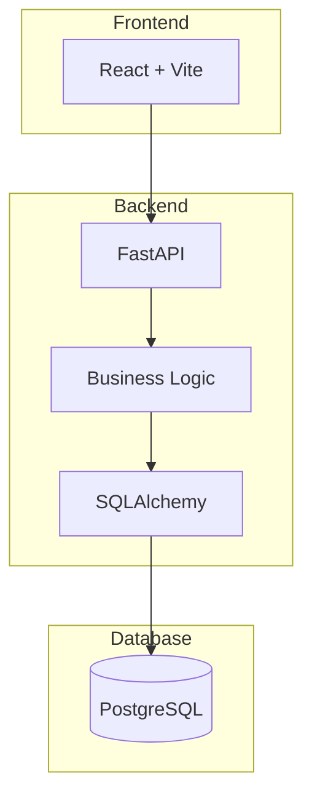

#  Stellar Inventory & Order Management System

A full-stack Inventory & Order Management System built using **React**, **FastAPI**, **PostgreSQL**, **Docker**, and **Docker Compose**.

The system enables businesses to manage products, customers, orders, and inventory with real-time stock tracking and business-rule validation.

---

#  Live Application

### Frontend

https://inventory-order-management-sys.vercel.app/

### Backend API

https://inventory-ordermanagementsys.onrender.com

### Docker Hub Image

https://hub.docker.com/r/chandan3docker/inventory-backend

### GitHub Repository

https://github.com/chandan3kumar/Inventory-OrderManagementSys

---

#  Technology Stack

## Frontend

* React (Vite)
* JavaScript
* CSS3

## Backend

* Python
* FastAPI
* SQLAlchemy

## Database

* PostgreSQL

## DevOps

* Docker
* Docker Compose
* Docker Hub

## Deployment

* Vercel
* Render

---

#  Features

## Product Management

* Add Products
* Update Products
* Delete Products
* View Product Catalog
* Unique SKU Validation

## Customer Management

* Add Customers
* Delete Customers
* View Customer Directory
* Unique Email Validation

## Order Management

* Create Orders
* View Orders
* Cancel Orders
* Automatic Stock Deduction
* Automatic Stock Restoration

## Inventory Tracking

* Real-Time Inventory Updates
* Low Stock Monitoring
* Inventory Validation Before Order Creation

---

#  Business Rules

## Product Rules

* SKU must be unique.
* Duplicate SKU entries are blocked.

## Customer Rules

* Customer email must be unique.
* Duplicate email registrations are blocked.

## Order Rules

* Orders cannot be placed if stock is insufficient.
* Stock quantity is automatically reduced after successful order creation.
* Order totals are calculated automatically by the backend.
* Cancelling an order restores inventory quantities.

---

# System Architecture



---

#  API Endpoints

## Products

```http
POST   /products
GET    /products
GET    /products/{id}
PUT    /products/{id}
DELETE /products/{id}
```

## Customers

```http
POST   /customers
GET    /customers
GET    /customers/{id}
DELETE /customers/{id}
```

## Orders

```http
POST   /orders
GET    /orders
GET    /orders/{id}
DELETE /orders/{id}
```

---

# Local Setup

## Clone Repository

```bash
git clone https://github.com/chandan3kumar/Inventory-OrderManagementSys.git
cd Inventory-OrderManagementSys
```

## Run Using Docker Compose

```bash
docker compose up --build
```

---

# Access Services

### Frontend

```txt
http://localhost
```

### Backend API

```txt
http://localhost:8000
```

### Backend Swagger Documentation

```txt
http://localhost:8000/docs
```

---

#  Docker Hub

Pull Backend Image:

```bash
docker pull chandan3docker/inventory-backend:latest
```

Run Backend Container:

```bash
docker run -p 8000:8000 chandan3docker/inventory-backend:latest
```

Docker Hub Repository:

https://hub.docker.com/r/chandan3docker/inventory-backend

---

#  Deployment

## Backend Deployment (Render)

Environment Variable:

```env
DATABASE_URL=postgresql://<username>:<password>@<host>/<database>
```

## Frontend Deployment (Vercel)

Environment Variable:

```env
VITE_API_URL=https://inventory-ordermanagementsys.onrender.com
```

---

---


**Chandan Kumar**

MCA (2024–2026)

 Backend Developer | Full Stack Developer

GitHub: https://github.com/chandan3kumar

LinkedIn: https://www.linkedin.com/in/chandan-kumar-160a12269
